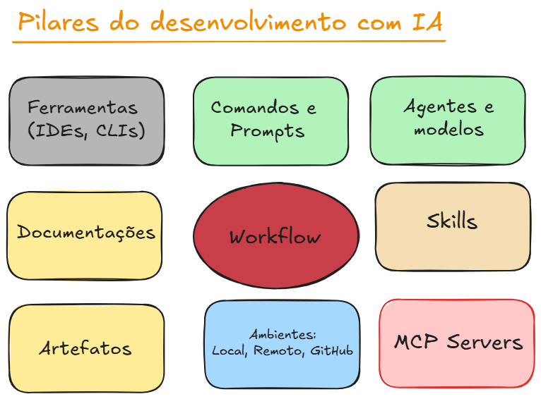

# Desenvolvimento de Aplicações com IA

A forma de desenvolver sofware mudou e vai continuar mudando a forma cada vez mais agressiva. O seu papel como profissional é se adaptar!
A profissão do Desenvolvedor já foi redefinida e continuará sendo!

## Ferramentas e Workflows

### Conceitos importantes

> Não se torne um profissional totalmente dependente de UMA ÚNICA ferramenta

- Ferramentas de IA já bateram a quantidade de frameworks e bibliotecas de JavaScript
- Evolução de todas é tão rápida que muitas vezes vale a pena até mesmo olhar o changelog diariamente.
- Muitas estão seguindo tendências de outras, porém, algumas inovações mudam novamente o fluxo de trabalho.
- Testem todas!
- Se tiverem condições, assinem as melhores. Mesmo que sua empresa não assine por você. A carreira é sua. Se você tem condições, esse investimento vai voltar.
- Sigam no X os desenvolvedores que estão construindo essas ferramentas. Você vai aprender bastante com eles.

## Workflows e projetos disponíveis para acelerar o desenvolvimento

- Para usar algo de alguém, você tem que ter ciência de como aquilo foi feito
- Cada vez mais usaremos diversos plugins, kits, workflows e metodologias de terceiros que vão acelerar seu processo. Igual fizemos a vida toda com os frameworks
- Reflexão: se todo mundo rodar os mesmos comandos, qual será o seu diferencial?

## Paralelização (Deixe de ser babá de IA)

- Você trabalhará em diversos projetos, branches, domínios, de formas diferentes, de forma simultânea. Isso é uma mudança de mindsite muito grande.
- Suas iterações com a IA vão diminuir absurdamente
- Raramente você colocará a mão no código, dependendo do seu nível de senioridade

## Documentação / Artefatos são as fontes de verdade

- Grande parte da sua função será gerar documentação
- Revisar
- Revisar
- Você terá a maior vontade do mundo para dar NEXT para IA ir para o próximo passo. Mas isso gerará uma bola de neve
- Há dois tipos de documentações:
  - Docs para IA
  - Docs para Humanos

## Arquitetura de Software e Solução

- Desenvolver software tende a cada vez mais ser algo comum (WIX)
- Hoje qualquer pessoa tem condições de desenvolver software.
- Mas... desenvolver softwares críticos, que escalam, resolvem problemas complexos e que se integram a outros ecossistemas precisam ser feitos por profissionais
- Um desenvolvedor profissional precisa DOMINAR arquitetura, pois escrever as linhas de código, ele não precisa mais.
- Desenvolvedores terão que reaprender arquitetura no mundo da IA. Muita coisa nova o tempo todo. Agentes, Frameworks, protocolos, etc.
- Desenvolvedores precisarão cada vez mais de entender de Produto

## Spec Driven Development

- Desenvolver de forma estruturada e agêntica através de especificações para a IA
- Entendimento do Produto
- Arquitetura e seu ecossistema
- Documentações e Artefatos
- Workflow

## Pilares do Desenvolvimento com IA

## Ferramentas / IDEs

- IDEs nascidas no contexto da IA: Cursor, Windsurf - Possuem modelos próprios.
- CLIs: Claude Code, Codex, Gemini, Cursor
- VS Code + GitHub Copilot
- Embedded Plugins: Codex, Claude Code, Gemini, Amazon Q
- JetBrains AI Assistant (Modelo Próprio) + External Plugins (ex.: Claude Code)
- Agent-first workflow: Google Antigravity\*
- Spec-Driven Development Tools: Amazon Kiro, Speckit, OpenSpec, BMAD
- Híbrida: Exemplo Cursor + Claude Code CLI
- E a cada dia surgem / desaparecem mais categorias e ferramentas

## Ferramentas que poderão ser utilizadas como exemplos durante as aulas

- Cursor (Interação com código, debugging, chats rápidos, Agent Manager, etc)
- Claude Code CLI - Web
- OpenAI Codex
- Google Antigravity
- Outras (sempre deixaremos abertas diversas possibilidades)

### Importante:

- Grande parte dessas ferramentas são pagas
- Não há obrigação de você fazer a contratação para acompanhar o curso
- Essas ferramentas estão convergindo para o mesmo caminho
- Muito do que implementaremos, incluindo workflows, serão baseados em prompts, comandos, agentes, skills que grande partes das IDEs já suportam
- Há recursos e instruções específicas do Claude Code que serão utilizadas que são específicas dele, logo, dependendo da sua ferramenta, você precisará fazer algumas adaptações

## Dinâmica da disciplina

- Trabalhar baseado em projetos práticos, mas com métodos totalmente diferentes
  - Projetos do zero (sem codebase)
  - Projetos legados (codebase antigo)
- Quais tipos de modelo devemos utilizar em cada situação incluindo custo
- Desenvolvimento de comandos simples que nos ajudam no dia a dia
- Plugins e servidores MCP "Obrigatórios"
- Como melhoramos a taxa de acertos dos agentes ao longo do tempo
- Agent Skills: como amplificar o poder dos agentes através de skills realmente úteis
- Estratégias de debug
- Testes automatizados
- Commits, PRs e Code Review
- Criação de subagentes em suas próprias janelas de contexto
- Workflows básicos
- Workflows avançados
- Loops de agentes para desenvolvimento de tarefas de longa duração
- Desenvolvimento paralelizado
- Desenvolvimento remoto pelo celular